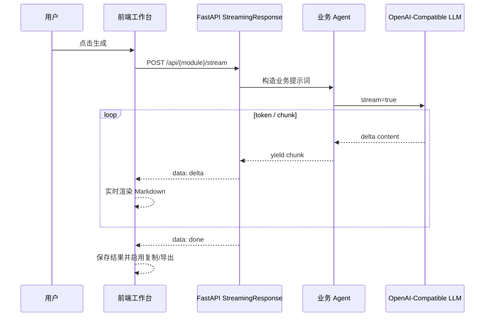
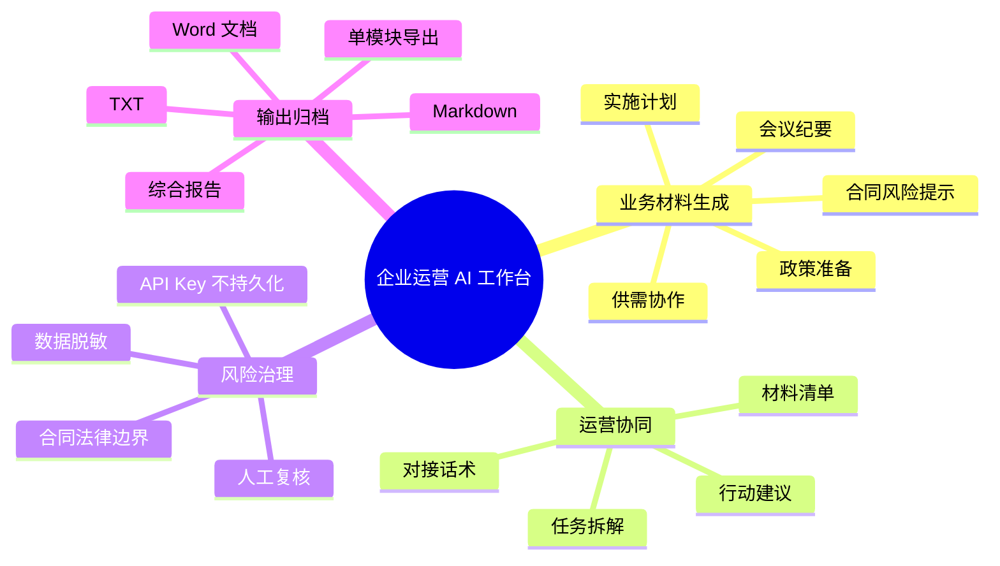
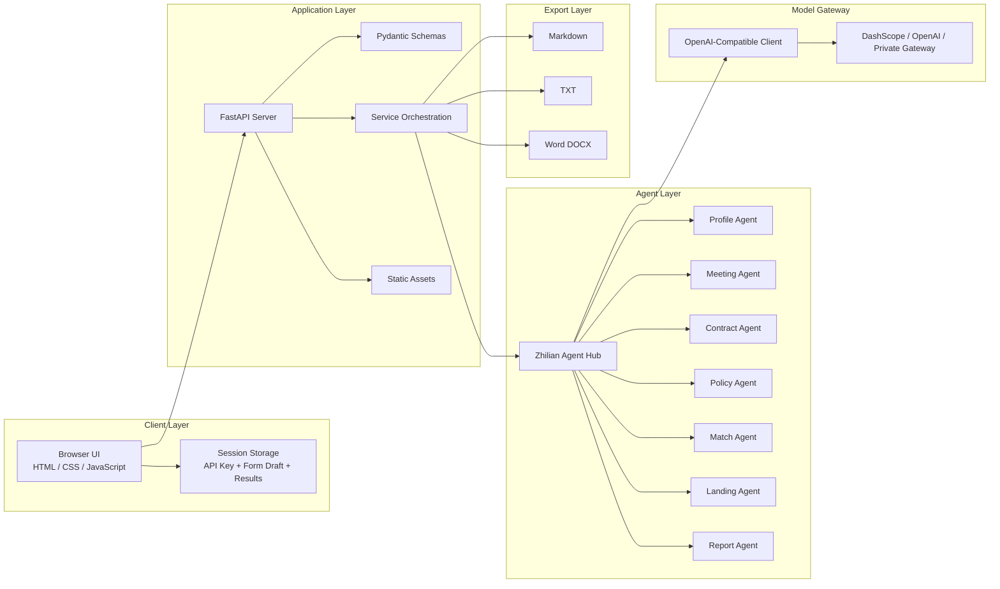
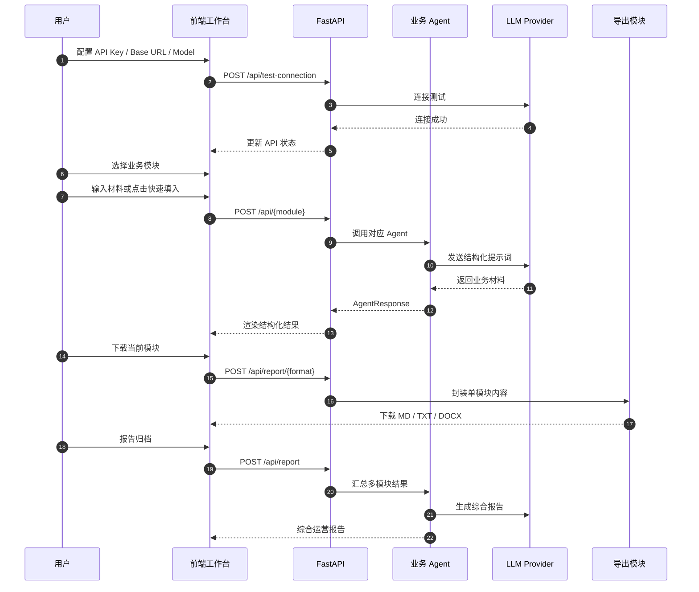
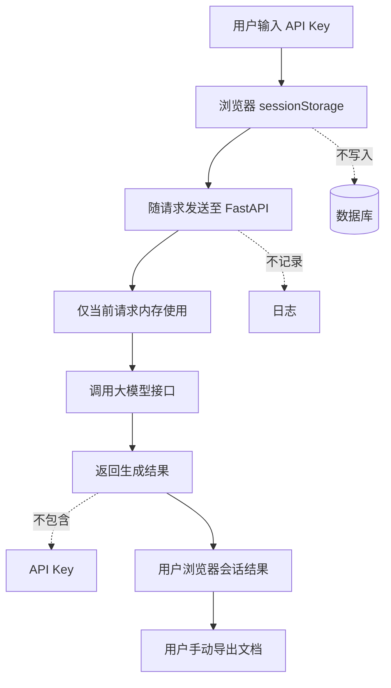
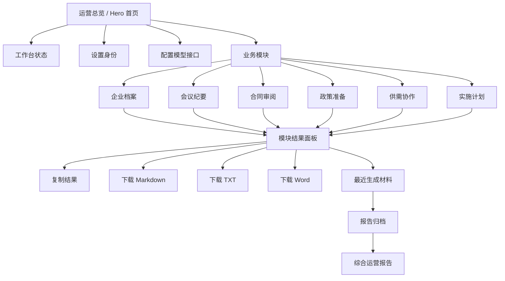
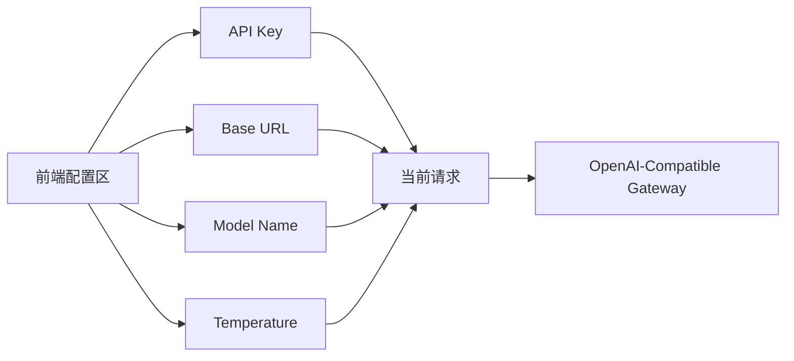
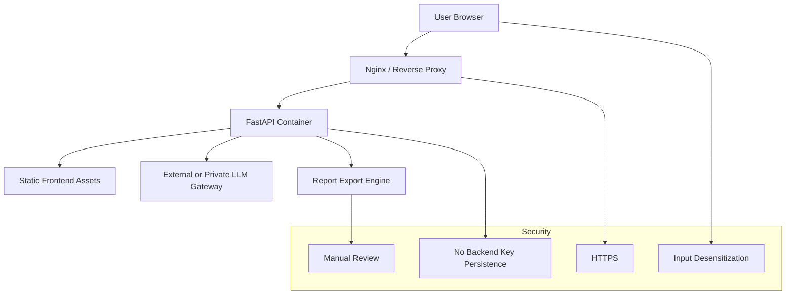
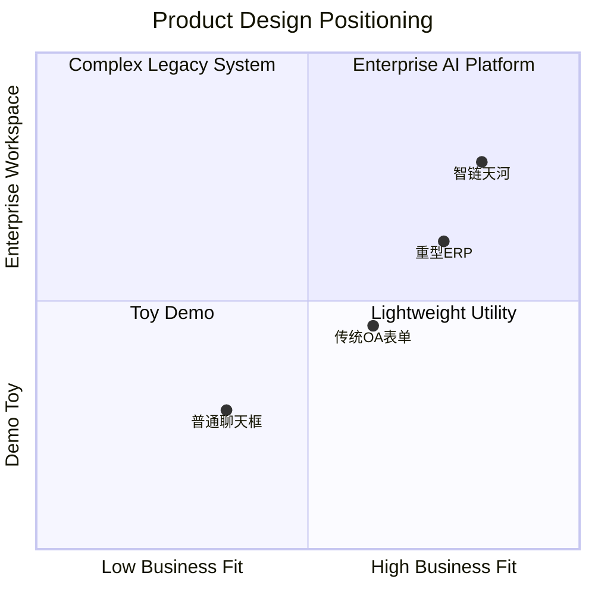
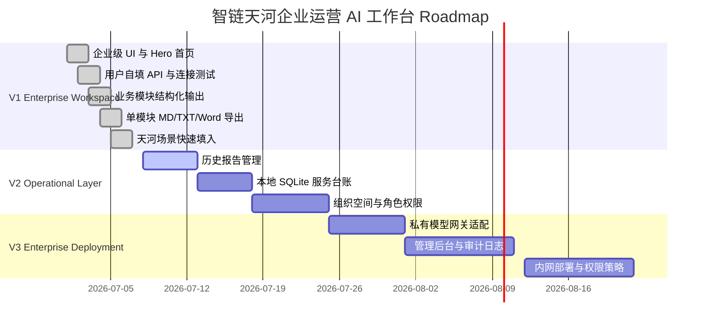

<div align="center">

# 智链天河 · 企业运营 AI 工作台

### ZhiLink Tianhe Enterprise AI Workspace

**面向企业、园区服务窗口、商圈运营团队与中小经营主体的 AI 运营材料生成、复核、流转与归档平台**

<br/>

## 🎨 立即访问在线演示

<p>
  <a href="https://zhilink-tianhe-ai-workspace.onrender.com" target="_blank">
    
  </a>
</p>

### 👆 点击上方图片即可访问在线演示

<p>
  <a href="https://zhilink-tianhe-ai-workspace.onrender.com" target="_blank">
    
  </a>
  <a href="https://github.com/liqinglq666/zhilink-tianhe-enterprise-ai-workspace" target="_blank">
    
  </a>
</p>

<p>
  🌐 在线体验地址：
  <a href="https://zhilink-tianhe-ai-workspace.onrender.com"><b>https://zhilink-tianhe-ai-workspace.onrender.com</b></a>
</p>

<p>
  <b>体验功能：</b>
  企业档案 → 会议纪要 → 合同审阅 → 政策准备 → 供需协作 → 实施计划 → 报告归档 · 支持流式生成
</p>

<br/>


</div>

---

## 在线 Demo 说明

当前在线体验版本部署在 **Render 免费实例** 上，主要用于作品展示、功能演示和评审体验。由于免费实例存在平台限制，网页在长时间无人访问后可能进入休眠状态，首次打开时可能出现几十秒冷启动等待，这是免费部署环境的正常现象，不代表系统不可用。

为控制演示成本，当前 Demo 采用轻量化部署方式：

- 不在服务端内置或保存大模型 API Key；
- 使用者需在网页左侧自行填写 OpenAI-Compatible API Key；
- API Key 默认仅保存在浏览器当前会话中；
- 业务文本和生成结果不作为生产数据持久化存储；
- 当前版本主要用于功能验证、场景演示和产品原型展示。

### 面向企业正式部署的建议方案

如果后续面向园区、商圈、企业服务窗口或具体企业客户正式使用，建议从“免费 Demo 部署”升级为“企业级生产部署”：

| 方向 | 建议措施 |
|---|---|
| 部署环境 | 使用云服务器、企业内网服务器、容器平台或专属 PaaS，避免免费实例休眠 |
| 访问稳定性 | 采用付费实例、自动扩缩容、健康检查、服务监控和异常告警 |
| 域名与安全 | 绑定企业专属域名，启用 HTTPS、访问控制和安全网关 |
| 模型接口 | 接入企业统一大模型网关，或由企业集中配置模型 API Key |
| 用户权限 | 增加账号体系、角色权限、组织空间和操作审计 |
| 数据治理 | 增加数据脱敏、敏感字段过滤、日志分级、数据留存周期和删除机制 |
| 结果归档 | 引入数据库或对象存储，支持历史报告、服务台账和版本追踪 |
| 运维保障 | 增加备份策略、部署流水线、监控面板和故障恢复方案 |

因此，当前在线地址可以理解为 **公开演示版 / Demo Deployment**；正式企业落地时，可升级为 **私有化部署 / 专属云部署 / 企业内网部署**，以满足稳定性、安全性、权限管理和数据合规要求。

---

## 流式生成体验

本版本已升级为 **流式生成（Streaming Generation）** 交互：用户点击生成后，系统会边调用大模型边实时渲染输出内容，避免长时间空白等待，更接近成熟 AI 产品的使用体验。

| 能力 | 说明 |
|---|---|
| 实时输出 | 会议纪要、合同审阅、政策准备等模块生成时会逐段显示内容 |
| 前端流式渲染 | 使用 `fetch + ReadableStream` 读取后端流式响应 |
| 后端 SSE 输出 | FastAPI 通过 `StreamingResponse` 返回 Server-Sent Events 风格数据 |
| 模型兼容 | 支持 OpenAI-Compatible `stream=true` 接口，包括 DashScope compatible-mode |
| 完成后归档 | 流式生成完成后，结果会自动进入当前会话，可复制、单模块导出或汇总到报告归档 |




## 0. Executive Summary

**智链天河 · 企业运营 AI 工作台** 不是一个普通的 AI 聊天页面，而是一套围绕企业运营材料生产链路设计的轻量级 AI 工作台。

系统以真实企业运营事项为中心，将会议记录、合同条款、政策诉求、供需信息与实施方案等非结构化材料转化为可复核、可流转、可归档的结构化业务文档，帮助企业和服务人员降低材料整理成本，提高协同效率，并形成标准化服务台账。

> 一句话：  
> **把企业日常运营中的“杂乱文本、临时沟通、模糊需求”转化为“结构化材料、风险提示、行动清单和可归档报告”。**

---

## 1. Product Vision

在企业、园区和商圈日常运营中，很多工作并不缺信息，而是缺少把信息快速整理成标准材料的能力：

- 会议结束后，没人及时整理纪要和待办；
- 合同合作频繁，但风险条款难以及时识别；
- 政策信息很多，但企业不知道如何理解和准备材料；
- 企业、商户、服务商之间有供需，却缺少标准化表达；
- AI 应用场景想法很多，但难以转化为试点方案；
- 生成的材料分散在聊天记录、文档、邮件里，难以归档复用。

本项目将这些高频运营场景封装为一套企业级 AI 工作台：



---

## 2. Core Value Proposition

| 维度 | 传统方式 | 智链天河工作台 |
|---|---|---|
| 会议处理 | 人工整理，容易遗漏 | 自动生成摘要、决策、待办、负责人和时间节点 |
| 合同审阅 | 完全依赖人工经验 | 快速识别付款、交付、违约、知识产权、数据安全等商务风险 |
| 政策准备 | 信息分散，难以判断 | 根据企业需求输出政策方向、材料清单和注意事项 |
| 供需协作 | 需求表达不标准 | 自动形成供需标签、合作建议和对接话术 |
| 实施计划 | 想法难以落地 | 生成试点路径、数据边界、复核机制和评估指标 |
| 文档归档 | 材料分散，难复用 | 支持单模块和综合报告多格式导出 |

---

## 3. Feature Highlights

### 3.1 企业级首页 Hero

- 内置专业视觉图 `frontend/assets/hero-enterprise-ai.png`
- 用于展示企业 AI 工作台定位
- 适合作为 GitHub README、项目首页、路演演示和在线 Demo 首页视觉

### 3.2 轻量身份入口

不做复杂注册登录系统，但支持设置当前使用身份：

- 单位 / 团队名称
- 使用角色
- 联系人 / 备注

角色包括：

```text
企业用户 / 园区服务人员 / 商圈运营人员 / 项目管理员
```

这使系统具备企业软件的上下文感，同时避免用户系统带来的复杂权限、数据库和安全成本。

### 3.3 API 必填与用户自主管理

系统不内置 API Key，也不提供本地规则假生成。  
所有正式业务结果都需要使用者自行配置模型接口：

- DashScope / 通义千问
- OpenAI 官方接口
- DeepSeek / 火山方舟 / 硅基流动等兼容接口
- 企业私有化模型网关

### 3.4 天河场景快速填入

每个模块内置典型天河区企业服务场景，一键填入表单，便于体验者快速理解系统能力。

| 模块 | 示例一 | 示例二 |
|---|---|---|
| 企业档案 | 天河路商圈运营团队 | 天河CBD专业服务企业 |
| 会议纪要 | 商圈活动筹备会 | CBD企业服务例会 |
| 合同审阅 | 商户联动协议 | AI服务采购条款 |
| 政策准备 | AI应用场景与大模型政策 | 商圈促消费与数字化经营 |
| 供需协作 | 商圈找 AI 服务商 | CBD 企业找专业服务 |
| 实施计划 | 商圈 AI 运营试点 | 企业服务窗口试点 |

### 3.5 单模块多格式导出

每个模块生成后，无需进入报告归档，即可独立导出：

```text
Markdown / TXT / Word DOCX
```

### 3.6 综合报告归档

多个模块结果可统一汇总为企业运营报告，用于：

- 内部流转
- 服务台账
- 项目复盘
- 客户沟通
- 政策材料整理
- 企业数字化服务记录

---

## 4. Capability Matrix

| 模块 | 输入 | AI 输出 | 适用场景 | 导出 |
|---|---|---|---|---|
| 企业档案 | 企业名称、行业、场景、规模、阶段、需求 | 企业画像、需求归纳、适用模块建议 | 企业服务接待、项目建档 | MD / TXT / DOCX |
| 会议纪要 | 会议记录、录音转写 | 摘要、决策、任务、负责人、风险提醒 | 运营会、项目推进会、招商会 | MD / TXT / DOCX |
| 合同审阅 | 合同关键条款 | 商务风险提示、复核建议、注意事项 | 服务合同、采购协议、商户合作 | MD / TXT / DOCX |
| 政策准备 | 政策需求、企业背景 | 政策方向、适配理由、材料清单 | 政策咨询、申报准备 | MD / TXT / DOCX |
| 供需协作 | 供给、需求、目标对象、场景 | 供需标签、合作建议、对接话术 | 企业撮合、商户合作、服务商对接 | MD / TXT / DOCX |
| 实施计划 | 试点场景、数据范围、部署方式、周期 | 试点路径、角色分工、KPI、风险控制 | AI 场景试点、工具落地 | MD / TXT / DOCX |
| 报告归档 | 已生成模块结果 | 综合运营报告 | 台账归档、汇报材料 | MD / TXT / DOCX |

---

## 5. Architecture Overview



---

## 6. Request Lifecycle



---

## 7. Data Governance

系统采取 **默认不持久化敏感材料** 的设计方式：



### 安全边界

| 对象 | 处理方式 |
|---|---|
| API Key | 默认会话级保存，不写入后端文件、数据库或报告 |
| 合同文本 | 建议用户脱敏后输入 |
| 客户数据 | 不建议输入完整手机号、身份证号、银行卡号等敏感信息 |
| AI 输出 | 作为初稿与辅助判断，必须人工复核 |
| 导出报告 | 只包含生成结果，不包含 API Key 和模型配置 |

---

## 8. Frontend Interaction Model



---

## 9. Directory Structure

```text
zhilian_tianhe_agent_fastapi_enterprise_ui_final/
├── backend/
│   ├── main.py              # FastAPI app, routes, middleware
│   ├── schemas.py           # Pydantic request/response models
│   └── service.py           # Agent hub creation and export helpers
│
├── frontend/
│   ├── index.html           # Enterprise SaaS single-page UI
│   └── assets/
│       ├── app.js           # State management, API calls, quick fill, export
│       ├── style.css        # Enterprise UI design system
│       └── hero-enterprise-ai.png
│
├── src/
│   └── zhilian_tianhe_agent/
│       ├── agents.py        # Agent orchestration
│       ├── prompts.py       # Prompt templates
│       ├── llm_client.py    # OpenAI-compatible LLM client
│       ├── reporting.py     # Markdown / TXT / DOCX builders
│       ├── constants.py     # App constants
│       └── utils.py
│
├── data/
│   ├── contract_risk_rules.json
│   ├── policy_directions.json
│   └── tianhe_knowledge.json
│
├── tests/
│   └── test_api.py
│
├── Dockerfile
├── docker-compose.yml
├── requirements.txt
├── pyproject.toml
├── .env.example
├── .dockerignore
├── LICENSE
└── README.md
```

---

## 10. Quick Start

### 10.1 Install Dependencies

```bash
python -m pip install -r requirements.txt
```

### 10.2 Run Locally

```bash
python -m uvicorn backend.main:app --reload --host 127.0.0.1 --port 8000
```

Open:

```text
http://127.0.0.1:8000
```

### 10.3 Run with Conda Interpreter

```bash
C:\anaconda3\envs\ecc_sim\python.exe -m uvicorn backend.main:app --reload --host 127.0.0.1 --port 8000
```

---

## 11. API Configuration

Default recommended configuration:

| Field | Value |
|---|---|
| Provider | 通义千问 DashScope |
| Base URL | `https://dashscope.aliyuncs.com/compatible-mode/v1` |
| Model | `qwen-plus` |
| Temperature | `0.35` |

The platform also supports any OpenAI-compatible endpoint.



---

## 12. Backend API Reference

| Method | Endpoint | Description |
|---|---|---|
| `GET` | `/` | Serve frontend |
| `GET` | `/health` | Health check |
| `GET` | `/api/defaults` | Provider presets and module metadata |
| `POST` | `/api/test-connection` | Test LLM connectivity |
| `POST` | `/api/profile` | Generate enterprise profile |
| `POST` | `/api/meeting` | Generate meeting notes |
| `POST` | `/api/contract` | Generate contract risk hints |
| `POST` | `/api/policy` | Generate policy preparation suggestions |
| `POST` | `/api/match` | Generate supply-demand collaboration plan |
| `POST` | `/api/landing` | Generate implementation plan |
| `POST` | `/api/report` | Generate AI-integrated report |
| `POST` | `/api/report/markdown` | Export Markdown |
| `POST` | `/api/report/txt` | Export TXT |
| `POST` | `/api/report/docx` | Export Word DOCX |
| `POST` | `/api/profile/stream` | 流式生成企业档案 |
| `POST` | `/api/meeting/stream` | 流式生成会议纪要 |
| `POST` | `/api/contract/stream` | 流式生成合同风险提示 |
| `POST` | `/api/policy/stream` | 流式生成政策准备建议 |
| `POST` | `/api/match/stream` | 流式生成供需协作方案 |
| `POST` | `/api/landing/stream` | 流式生成实施计划 |
| `POST` | `/api/report/stream` | 流式生成综合运营报告 |

---

## 13. Deployment

### Docker Compose

```bash
docker compose up -d --build
```

Open:

```text
http://localhost:8000
```

Stop:

```bash
docker compose down
```

### Deployment Topology



---

## 14. Testing

Run API tests:

```bash
pytest -q
```

Expected:

```text
6 passed
```

Check frontend JavaScript:

```bash
node --check frontend/assets/app.js
```

Check Python compilation:

```bash
python -m compileall backend src tests
```

---

## 15. Design Principles



Design choices:

- Not a generic chatbot.
- Not a heavy ERP system.
- Not a simple form demo.
- A lightweight enterprise AI workspace with structured output and export capability.

---

## 16. Development Guide

### Modify UI

```text
frontend/index.html
frontend/assets/style.css
```

### Modify Interactions

```text
frontend/assets/app.js
```

### Modify Agent Outputs

```text
src/zhilian_tianhe_agent/prompts.py
```

### Modify LLM Provider Logic

```text
src/zhilian_tianhe_agent/llm_client.py
```

### Modify Export Format

```text
src/zhilian_tianhe_agent/reporting.py
backend/main.py
frontend/assets/app.js
```

---

## 17. Roadmap



---

## 18. Recommended GitHub Metadata

### Repository Name

```text
zhilian-tianhe-enterprise-ai-workspace
```

### Description

```text
Enterprise AI operations workspace for meeting notes, contract risk review, policy preparation, supply-demand collaboration, implementation planning and report archiving.
```

### Topics

```text
enterprise-ai
fastapi
openai-compatible
dashscope
qwen
ai-agent
business-automation
contract-review
meeting-summary
policy-assistant
b2b-saas
report-generation
```

---

## 19. License

```text
Copyright (c) 2026 李庆
All Rights Reserved.
```

本项目当前采用 **保留所有权利（All Rights Reserved）** 方式发布。即使仓库公开展示，也不代表开放复制、修改、再发布、商用部署或二次参赛授权。

未经作者明确书面许可，任何第三方不得：

- 复制、修改、分发或再授权本项目；
- 将本项目用于商业交付或对外提供服务；
- 将本项目改名包装后作为自己的作品、产品或参赛项目提交；
- 移除作者信息、版权声明或项目来源说明；
- 复用本项目的 UI 设计、业务流程、提示词结构、数据文件或文档内容进行衍生发布。

---

## 20. Final Statement

> **智链天河 · 企业运营 AI 工作台** 以企业运营材料为核心对象，以大模型为生成引擎，以结构化输出和报告归档为交付形态，面向真实企业服务场景，提供一套轻量、可部署、可复核、可扩展的 AI 工作台解决方案。
